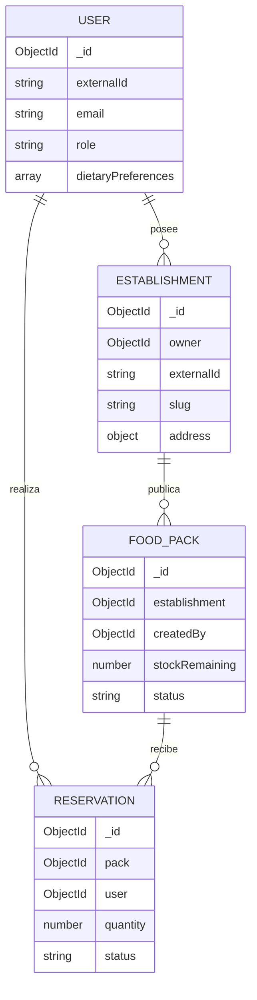

# RePlato

RePlato es una plataforma full stack para dar salida a excedentes alimentarios de comercios locales. Panaderías, restaurantes, cafeterías y tiendas publican packs a precio reducido; las personas usuarias los reservan y recogen dentro de una franja horaria concreta.

El proyecto está dirigido a dos públicos complementarios:

- Personas que quieren acceder a comida en buen estado a un precio menor.
- Comercios que necesitan reducir desperdicio, recuperar parte del coste y medir el impacto de los packs rescatados.

La aplicación combina una API REST desarrollada con Node.js, Express y MongoDB con una interfaz responsive construida en React. El conjunto de datos inicial parte de un libro Excel y se importa mediante CSV usando el módulo `fs` de Node.js.

## Enlaces de entrega

Las direcciones definitivas se añaden después del primer despliegue, ya que Render y Vercel las asignan al crear cada servicio.

| Recurso | Dirección |
| --- | --- |
| Frontend | Pendiente de asignar en Vercel |
| API | Pendiente de asignar en Render |
| Estado de la API | `{URL_API}/api/health` |

No se incluyen credenciales privadas ni direcciones de despliegue ficticias en este documento.

## Funcionalidades principales

- Catálogo público de packs con búsqueda, filtros por ciudad y categoría, orden y paginación infinita.
- Detalle de cada oferta con comercio, precio original y reducido, stock, alérgenos y horario de recogida.
- Registro e inicio de sesión con JWT. Todo registro público recibe siempre el rol `user`.
- Reserva de packs con control atómico de stock y prevención de reservas duplicadas.
- Área personal para consultar y cancelar reservas.
- Panel de comercio para consultar sus establecimientos vinculados, publicar o eliminar ofertas, subir imágenes y gestionar reservas recibidas.
- Panel de administración para consultar usuarios y modificar roles.
- Ciclo de estados controlado para las reservas: `pending`, `confirmed`, `collected` y `cancelled`.
- Subida de imágenes mediante `multipart/form-data`, Multer y Cloudinary.
- Sustitución segura de imágenes y eliminación de la imagen asociada al borrar una oferta.
- Indicadores agregados de packs, alimento recuperable, CO₂ evitado y reservas recogidas.
- Estados de carga, error y ausencia de resultados reutilizables.
- Navegación protegida por sesión y por rol tanto en la interfaz como en la API.

## Tecnologías

### Backend

- Node.js y Express 5
- MongoDB y Mongoose
- JWT y bcryptjs
- Zod para validar y transformar entradas
- Multer y Cloudinary para imágenes
- `fs` y `csv-parse` para la semilla
- Helmet, CORS, compresión y limitación de peticiones de autenticación
- Vitest y Supertest

### Frontend

- React 19 y Vite
- React Router
- TanStack Query
- React Hook Form, Zod y resolvers
- Framer Motion
- Lucide React
- Recharts
- date-fns
- CSS propio con variables de diseño y media queries
- Testing Library y Vitest

## Arquitectura

El repositorio utiliza *npm workspaces* para mantener frontend y backend independientes dentro de un único proyecto.

```text
replato-proyecto-final/
├── client/
│   ├── src/
│   │   ├── api/             # Cliente HTTP y persistencia de sesión
│   │   ├── app/             # Enrutado y carga diferida de páginas
│   │   ├── components/      # UI reutilizable por dominio y layout
│   │   ├── context/         # Estado de autenticación compartido
│   │   ├── hooks/           # Lógica reutilizable y hooks de datos
│   │   ├── pages/           # Vistas asociadas a rutas
│   │   ├── routes/          # Guardas de autenticación y roles
│   │   ├── styles/          # Tokens, base, componentes y responsive
│   │   ├── tests/           # Configuración y pruebas del cliente
│   │   └── utils/           # Formateadores puros
│   └── vite.config.js
├── server/
│   ├── data/
│   │   ├── csv/             # Datos exportados del Excel
│   │   └── replato_dataset.xlsx
│   └── src/
│       ├── config/          # Entorno, MongoDB y Cloudinary
│       ├── controllers/     # Adaptación HTTP
│       ├── middleware/      # Auth, roles, validación, upload y errores
│       ├── models/          # Esquemas Mongoose
│       ├── routes/          # Contrato REST
│       ├── scripts/         # Lectura, validación y carga de la semilla
│       ├── services/        # Casos de uso y reglas de negocio
│       ├── tests/           # Pruebas de API, esquemas y dataset
│       └── utils/           # Errores y manejadores asíncronos
├── render.yaml              # Infraestructura declarativa de la API
└── vercel.json              # Build y fallback SPA del frontend
```

### Patrones y decisiones

- **Arquitectura por capas:** ruta → middleware → controlador → servicio → modelo. El controlador conserva una responsabilidad HTTP mínima y las reglas del dominio viven en servicios comprobables.
- **Middleware encadenado:** autenticación, autorización, validación, procesamiento de ficheros y gestión de errores se aplican de forma uniforme.
- **Provider/Context:** `AuthProvider` ofrece la sesión a todo el árbol sin prop drilling.
- **Reducer:** el proceso de reserva usa una máquina de estados pequeña y predecible mediante `useReducer`.
- **Servidor remoto como estado:** TanStack Query controla caché, carga, error, reintentos, invalidación y paginación.
- **Componentes de presentación reutilizables:** tarjetas, precios, logo, navegación y estados asíncronos reciben datos por propiedades y evitan repetir marcado.
- **Carga diferida por ruta:** las páginas se importan con `lazy` y `Suspense` para reducir el JavaScript inicial.

## Modelo de datos

La base de datos contiene cuatro colecciones. Tres de ellas forman el dominio principal, además de usuarios.



### `users`

Guarda identidad, contraseña cifrada, rol, ciudad, preferencias alimentarias y estado de la cuenta. El email y el identificador externo son únicos.

### `establishments`

Representa un comercio y referencia a su propietario mediante `owner → User`. Incluye dirección GeoJSON, categoría, horarios, etiquetas y estado de verificación.

### `foodpacks`

Representa una oferta y referencia a un comercio mediante `establishment → Establishment` y a la persona que la publicó mediante `createdBy → User`. Almacena precios en céntimos para evitar errores de coma flotante, stock, horario, etiquetas, alérgenos, imagen e impacto estimado.

### `reservations`

Relaciona `user → User` con `pack → FoodPack`. El índice compuesto único `{ user, pack }` impide que una misma persona reserve dos veces el mismo pack. También incluye cantidad, código de recogida, estado, valoración y datos de cancelación.

## Roles y permisos

La autorización se comprueba en el servidor; ocultar una opción en React nunca sustituye esa validación.

| Acción | Visitante | `user` | `partner` | `admin` |
| --- | :---: | :---: | :---: | :---: |
| Consultar comercios y ofertas | Sí | Sí | Sí | Sí |
| Crear cuenta e iniciar sesión | Sí | Sí | Sí | Sí |
| Reservar un pack | No | Sí | No | No |
| Ver y cancelar reservas propias | No | Sí | Sí | Sí |
| Crear un comercio | No | No | Sí | Sí |
| Gestionar comercios propios | No | No | Sí | Sí |
| Publicar y gestionar ofertas propias | No | No | Sí, con comercio verificado | Sí |
| Gestionar estados de reservas recibidas | No | No | Sí | Sí |
| Ver todos los usuarios | No | No | No | Sí |
| Modificar roles | No | No | No | Sí |

Reglas adicionales:

- `POST /api/auth/register` ignora cualquier intento de elevar permisos y crea siempre un usuario con rol `user`.
- Un administrador puede promover usuarios a `partner` o `admin`.
- Un administrador no puede retirarse a sí mismo su propio rol de administración.
- Un `partner` solo puede modificar los comercios y ofertas que le pertenecen.
- Una reserva no puede pasar a un estado arbitrario: `pending → confirmed/cancelled` y `confirmed → collected/cancelled`.

## Excel, CSV y semilla

La fuente original está en [`server/data/replato_dataset.xlsx`](server/data/replato_dataset.xlsx). Contiene hojas informativas, catálogos y cuatro tablas relacionadas. Las hojas de datos se exportaron a `server/data/csv/`.

| Archivo | Registros | Relación principal |
| --- | ---: | --- |
| `users.csv` | 40 | Fuente de propietarios y clientes |
| `establishments.csv` | 24 | `owner_external_id → users.external_id` |
| `food_packs.csv` | 120 | `establishment_external_id → establishments.external_id` |
| `reservations.csv` | 180 | `user_external_id → users.external_id` y `pack_external_id → food_packs.external_id` |
| **Total** | **364** |  |

La semilla se ejecuta en este orden para poder resolver las referencias:

1. `seedDatabase.js` solicita los cuatro CSV en paralelo.
2. `seedUtils.js` los lee con `fs.promises.readFile` y los interpreta con `csv-parse`.
3. Antes de conectar con MongoDB se validan el mínimo de 100 ofertas, IDs, emails, slugs, precios, propietarios, referencias y pares de reserva duplicados.
4. Se insertan o actualizan usuarios por `externalId` y se crea un mapa `externalId → ObjectId`.
5. Se repite el proceso con comercios, packs y reservas para transformar las claves externas del Excel en referencias reales de MongoDB.
6. Las operaciones usan `bulkWrite` con `upsert`, por lo que volver a ejecutar la semilla actualiza los registros sin multiplicarlos.
7. Las fechas de recogida se calculan respecto al día de ejecución para que las ofertas de demostración sigan siendo utilizables.

En producción la semilla está bloqueada salvo que se defina temporalmente `ALLOW_SEED=true`.

## API REST

La URL base local es `http://localhost:4000/api`. Las respuestas correctas usan `data` y, cuando corresponde, `meta`. Los errores tienen la forma:

```json
{
  "error": {
    "code": "ERROR_CODE",
    "message": "Descripción legible",
    "requestId": "identificador-de-peticion"
  }
}
```

Las rutas protegidas esperan:

```http
Authorization: Bearer <token>
```

### Sistema y autenticación

| Método | Ruta | Acceso | Descripción |
| --- | --- | --- | --- |
| `GET` | `/health` | Público | Salud de API y estado de MongoDB |
| `GET` | `/` | Público | Nombre y versión de la API |
| `POST` | `/auth/register` | Público | Registra siempre con rol `user` |
| `POST` | `/auth/login` | Público | Devuelve usuario y JWT |
| `GET` | `/auth/me` | Sesión | Comprueba la sesión y devuelve el perfil |

### Usuarios

| Método | Ruta | Acceso | Descripción |
| --- | --- | --- | --- |
| `GET` | `/users` | `admin` | Lista usuarios |
| `PATCH` | `/users/:id/role` | `admin` | Cambia el rol a `user`, `partner` o `admin` |

### Comercios

| Método | Ruta | Acceso | Descripción |
| --- | --- | --- | --- |
| `GET` | `/establishments` | Público | Lista activos; admite `city` y `category` |
| `GET` | `/establishments/mine` | `partner`, `admin` | Lista los comercios gestionables |
| `GET` | `/establishments/:idOrSlug` | Público | Obtiene un comercio |
| `POST` | `/establishments` | `partner`, `admin` | Crea un comercio |
| `PATCH` | `/establishments/:id` | Propietario, `admin` | Actualiza un comercio |
| `DELETE` | `/establishments/:id` | Propietario, `admin` | Realiza una baja lógica |

### Packs

| Método | Ruta | Acceso | Descripción |
| --- | --- | --- | --- |
| `GET` | `/food-packs` | Público | Busca y pagina ofertas disponibles |
| `GET` | `/food-packs/featured` | Público | Devuelve ofertas destacadas |
| `GET` | `/food-packs/impact` | Público | Devuelve métricas agregadas |
| `GET` | `/food-packs/mine` | `partner`, `admin` | Lista ofertas gestionables |
| `GET` | `/food-packs/:id` | Público | Obtiene una oferta |
| `POST` | `/food-packs` | `partner`, `admin` | Crea una oferta; acepta una imagen |
| `PATCH` | `/food-packs/:id` | Propietario, `admin` | Edita una oferta y puede sustituir su imagen |
| `DELETE` | `/food-packs/:id` | Propietario, `admin` | Borra la oferta si no tiene reservas activas |

Filtros disponibles en `GET /food-packs`: `search`, `category`, `city`, `establishment`, `featured`, `page`, `limit` y `sort` (`pickup`, `price` o `newest`).

Para crear o editar un pack con imagen se envía `multipart/form-data`. El campo de fichero se llama `image`; se permiten JPG, PNG y WebP de hasta 5 MB.

### Reservas

| Método | Ruta | Acceso | Descripción |
| --- | --- | --- | --- |
| `POST` | `/reservations` | `user` | Reserva unidades de un pack |
| `GET` | `/reservations/mine` | Sesión | Lista reservas propias |
| `GET` | `/reservations/received` | `partner`, `admin` | Lista reservas recibidas |
| `PATCH` | `/reservations/:id/status` | Propietario, `admin` | Cambia el estado según el flujo permitido |
| `DELETE` | `/reservations/:id` | Propietario de la reserva, `admin` | Cancela y devuelve el stock |

La reducción de `stockRemaining` se realiza con una actualización condicional atómica. Si la creación de la reserva falla, el servicio compensa el stock para mantener la consistencia.

## Frontend y hooks avanzados

| Hook o técnica | Uso concreto |
| --- | --- |
| `AuthContext` + `useContext` | Comparte usuario, token, login, registro y cierre de sesión |
| `useEffect` | Revalida el token con `/auth/me`, sincroniza filtros y actualiza el título |
| `useInfiniteQuery` | Carga el catálogo por páginas y conserva la caché |
| `useQuery` / `useMutation` | Gestiona lecturas, escrituras, errores e invalidaciones |
| `useReducer` | Modela cantidad y estados del flujo de reserva |
| `useDeferredValue` | Mantiene fluida la escritura en el buscador |
| `useDebouncedValue` | Evita una petición por cada pulsación |
| `useIntersectionObserver` | Solicita la siguiente página al alcanzar el final del listado |
| `useMemo` / `useCallback` | Estabiliza valores y acciones compartidas cuando aporta valor |
| `memo` | Evita renderizados innecesarios de tarjetas sin cambios |
| `lazy` + `Suspense` | Divide el bundle por páginas |

Las rutas principales son:

| Ruta | Vista |
| --- | --- |
| `/` | Portada y ofertas destacadas |
| `/ofertas` | Catálogo con filtros |
| `/ofertas/:id` | Detalle y reserva |
| `/como-funciona` | Explicación del servicio |
| `/login` y `/registro` | Acceso y alta |
| `/mis-reservas` | Área privada de usuario |
| `/partner` | Panel de comercio |
| `/admin` | Panel de administración |
| `/sin-permiso` | Estado de autorización insuficiente |

`ProtectedRoute` exige sesión y `RoleRoute` limita los paneles según el rol. Las rutas se cargan de forma diferida.

## CSS, responsive y accesibilidad

El punto de entrada de estilos es `client/src/styles/style.css`. Las variables de `:root` centralizan:

- Paleta de marca, fondos, texto, bordes y estados.
- Escala de espacios reutilizable.
- Radios, sombras, anchos máximos y capas.
- Tipografía y transiciones.

Los estilos se organizan en `base.css`, `components.css`, `pages.css` y `responsive.css`. Se reutilizan clases como `.container`, `.button`, `.food-grid`, `.form-field` y los estados comunes en vez de duplicar reglas por página.

La interfaz está planteada desde móvil y adapta navegación, rejillas, formularios, tablas y paneles a tablet y escritorio. También incorpora:

- Foco visible para navegación por teclado.
- Etiquetas y nombres accesibles en formularios y botones de icono.
- Regiones `aria-live` para resultados y cambios de estado.
- Mensajes de carga, error y vacío.
- Imágenes con dimensiones, carga diferida y texto alternativo contextual.
- Respeto por `prefers-reduced-motion`.

## Instalación local

### Requisitos

- Node.js 20 o superior
- npm 10 o superior
- MongoDB local o una base de datos en MongoDB Atlas
- Cuenta de Cloudinary solo si se quiere probar la subida de imágenes

### 1. Instalar dependencias

Desde la raíz del proyecto:

```bash
npm install
```

### 2. Configurar el backend

Copia `.env.example` como `server/.env` y completa los valores necesarios:

```dotenv
NODE_ENV=development
PORT=4000
MONGODB_URI=mongodb://127.0.0.1:27017/replato
JWT_SECRET=usa-una-clave-larga-y-privada
CLIENT_URL=http://localhost:5173
CLOUDINARY_CLOUD_NAME=
CLOUDINARY_API_KEY=
CLOUDINARY_API_SECRET=
SEED_DEFAULT_PASSWORD=RePlato2026!
```

`CLIENT_URL` admite varios orígenes separados por comas. Las variables de Cloudinary pueden quedar vacías mientras no se intente subir un fichero.

### 3. Configurar el frontend

Copia `client/.env.example` como `client/.env`:

```dotenv
VITE_API_URL=http://localhost:4000/api
```

### 4. Generar la base de datos

Con MongoDB disponible y `MONGODB_URI` configurada:

```bash
npm run seed
```

### 5. Arrancar el proyecto

```bash
npm run dev
```

- Frontend: `http://localhost:5173`
- API: `http://localhost:4000/api`
- Salud: `http://localhost:4000/api/health`

## Cuentas de demostración

La semilla crea cuentas para comprobar los tres permisos:

| Rol | Correo | Contraseña |
| --- | --- | --- |
| Administrador | `admin@replato.test` | `RePlato2026!` |
| Comercio | `partner@replato.test` | `RePlato2026!` |
| Usuario | `user@replato.test` | `RePlato2026!` |

Estas cuentas son únicamente datos de demostración. En un entorno público deben cambiarse o eliminarse al terminar la evaluación.

## Scripts

| Comando | Función |
| --- | --- |
| `npm run dev` | Arranca API y frontend en paralelo |
| `npm run build` | Genera el bundle de producción del cliente |
| `npm start` | Arranca la API en modo normal |
| `npm run seed` | Valida los CSV y genera/actualiza la base de datos |
| `npm test` | Ejecuta las suites de backend y frontend |
| `npm run lint` | Analiza `client/src` y `server/src` con Oxlint |
| `npm run check` | Ejecuta lint, pruebas y build |

También se puede ejecutar cada workspace por separado, por ejemplo `npm run test -w server` o `npm run dev -w client`.

## Pruebas y calidad

Antes de entregar se recomienda ejecutar:

```bash
npm run check
```

La suite incluye 17 pruebas automatizadas: 7 del servidor y 10 del cliente. El backend comprueba el endpoint de salud, la respuesta de rutas inexistentes, la validación de entradas y las reglas del dataset; verifica que hay 364 registros, 120 ofertas y que una relación rota se detecta antes de escribir en MongoDB. El cliente valida hooks, guardas por sesión y rol, tarjetas reutilizables y los flujos de login y registro con Vitest, jsdom y Testing Library.

Además de las pruebas automatizadas, la API aplica:

- Validación Zod antes de llegar a los servicios.
- Hash de contraseñas con bcrypt.
- JWT con caducidad de siete días.
- Cabeceras de seguridad con Helmet.
- Lista de orígenes CORS.
- Límite de 30 intentos cada 15 minutos en registro e inicio de sesión.
- Límite de cuerpo JSON y tamaño/tipo de imagen.
- Errores consistentes con código, mensaje e identificador de petición.

## Despliegue

### API en Render

El archivo `render.yaml` define un servicio web Node con:

- Build: `npm install`
- Inicio: `npm run start -w server`
- Health check: `/api/health`

En Render deben configurarse `MONGODB_URI`, `CLIENT_URL` y las tres variables de Cloudinary. `JWT_SECRET` puede generarse desde el blueprint. No se deben pegar secretos en el repositorio.

Para cargar MongoDB Atlas desde Render, abre una Shell del servicio, define `ALLOW_SEED=true` solo durante la operación, ejecuta `npm run seed` y retira después esa variable. También se puede ejecutar la semilla desde local apuntando a Atlas.

### Frontend en Vercel

`vercel.json` instala desde la raíz, construye el workspace `client`, publica `client/dist` y redirige las rutas de la SPA a `index.html`.

En Vercel debe definirse:

```dotenv
VITE_API_URL=<URL-REAL-DE-RENDER>/api
```

El marcador debe sustituirse por la URL real asignada al backend. Una vez publicado el frontend, su origen real se configura como `CLIENT_URL` en Render para que CORS lo permita.

Orden recomendado:

1. Crear MongoDB Atlas y configurar acceso de red y usuario de aplicación.
2. Publicar el backend en Render y comprobar `/api/health`.
3. Ejecutar la semilla contra Atlas.
4. Publicar el frontend en Vercel con `VITE_API_URL` apuntando a Render.
5. Actualizar `CLIENT_URL` en Render con el dominio de Vercel.
6. Sustituir la tabla **Enlaces de entrega** por las dos direcciones reales.

## Criterios cubiertos

- Variables de colores, espacios, radios, sombras y transiciones en `style.css`.
- CSS reutilizable y organizado por responsabilidades.
- Tres colecciones relacionadas además de usuarios: comercios, packs y reservas.
- Arquitectura React por capas de UI, datos, contexto, hooks, rutas y páginas.
- UX/UI responsive con feedback completo y navegación adaptada.
- Componentes reutilizables y páginas con carga diferida.
- Base de datos construida a partir de un Excel con 364 registros relacionados.
- Lectura de CSV con `fs` y semilla idempotente.
- Hooks avanzados aplicados a problemas concretos.
- Autenticación, roles y permisos validados en backend y frontend.
- API REST, gestión de imágenes y documentación de despliegue.
